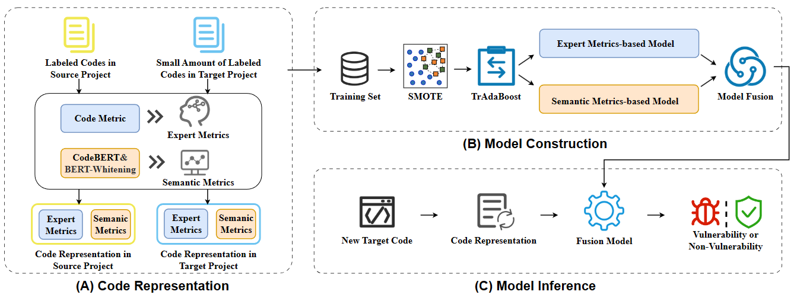

# CSVD-TF

CSVD-TF: Cross-project Software Vulnerability Detection with TrAdaBoost by Fusing Expert Metrics and Semantic Metrics

## Dataset preparation

You can download the preprocessed dataset from [here](https://drive.google.com/file/d/19C360SRMZYBiq3oS_UyGLkXU2f2d4AiZ/view?usp=sharing) and move it to `data`.

If you would like to obtain more information about the dataset, please refer to `data/readme.md`

## Requirements

Environment can be set up by running the following command in the root directory of the project: `pip install -r requirePackage.txt`

## Run

If you want to directly run our model, you can use the preprocessed data we provide and directly run `run.py`. Please note that the provided data is a multidimensional vector where the first 39 dimensions are expert metric vectors, dimensions 40-295 are semantic metric vectors, and the last dimension represents the vulnerability label.

If you want to extract expert metrics by yourself, you can use the "Understand" (Version 5.0) tool and import the provided source code directly.

If you want to extract semantic metrics by yourself, you can run `bert_whitening.py`.

The obtained vectors need to undergo additional preprocessing operations to be transformed into the preprocessed data we provide. If you would like to obtain more information, please refer to `readme.md` in these folders.

